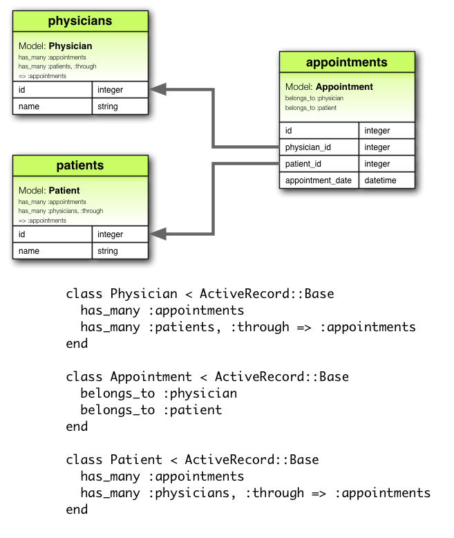
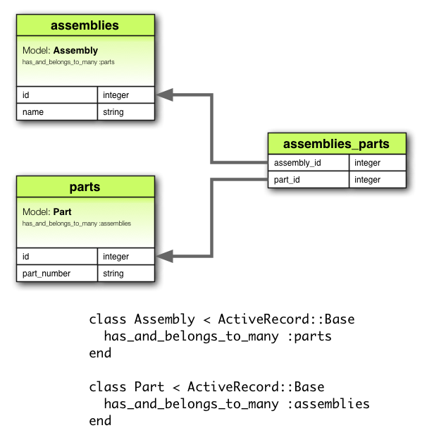

# RAILS GUIDE

highlighted with http://tinker.kotaweaver.com/blog/?p=152

## 1. Введение

environment:

    ruby > 1.9.3
    RubyGems

установка

    $ gem install rails
    $ rails --version
    
ещё раз о структуре:


Создание приложения Blog

    $ rails new blog

структура (самые важные части) проекта:
<table>
    <tr>
        <td>app/</td>
        <td>Контроллеры, модели, вьюхи, хелперы, рассыльщики и ресурсы вашего приложения. </td>
    </tr>
    <tr>
        <td>script/</td>
        <td>Скрипты для старта/деплоя/ещё чего нибудь (В rails 4  переименован в bin)</td>
    </tr>
    <tr>
        <td>config/	</td>
        <td>Конфигурации маршрутов, БД  и т.д. </td>
    </tr>
    <tr>
        <td>db/</td>
        <td>Содержит текущую схему вашей базы данных, а также миграции базы данных.</td>
    </tr>
    <tr>
        <td>Gemfile, Gemfile.lock</td>
        <td>Эти файлы позволяют указать, какие зависимости от гемов нужны для вашего приложения на Rails. 
        Эти файлы используются гемом Bundler. </td>
    </tr>
    <tr>
        <td>lib/</td>
        <td>Внешние модули для вашего приложения.</td>
    </tr>
    <tr>
        <td>log/</td>
        <td>Файлы логов приложения.</td>
    </tr>
    <tr>
        <td>public/</td>
        <td>Единственная папка, которая доступна извне как есть. 
        Содержит статичные файлы и скомпилированные ресурсы.</td>
    </tr>
    <tr>
        <td>Rakefile</td>
        <td>Содержит набор команд, которые могут быть запущены в командной строке. 
        Вместо изменения Rakefile, вы можете добавить свои собственные задачи, добавив файлы в  lib/tasks.</td>
    </tr>
    <tr>
        <td>test/</td>
        <td>Юнит-тесты, фикстуры и прочий аппарат тестирования. </td>
    </tr>
    <tr>
        <td>tmp/</td>
        <td>Временные файлы (такие как файлы кэша, pid и сессии)</td>
    </tr>
    <tr>
        <td>vendor/</td>
        <td>Место для кода внешних разработчиков. В типичном приложении на Rails, включает внешние гемы.</td>
    </tr>
</table>

Запуск локального веб-сервера

    $ bin/rails server
    
Это запустит WEBrick, веб-сервер, распространяющийся с Ruby по умолчанию, 
посмотреть можно по http://localhost:3000

создание контроллера и экшена

    $ bin/rails generate controller welcome index
    
Rails создаст несколько файлов и маршрут.
    
    create  app/controllers/welcome_controller.rb
     route  get 'welcome/index'
    invoke  erb
    create    app/views/welcome
    create    app/views/welcome/index.html.erb
    invoke  helper
    create    app/helpers/welcome_helper.rb
    invoke    test_unit
    create      test/helpers/welcome_helper_test.rb
    invoke  assets
    invoke    coffee
    create      app/assets/javascripts/welcome.js.coffee
    invoke    scss
    create      app/assets/stylesheets/welcome.css.scss


## 2. Модели

### 2.1 Введение в модели

Active Record это фреймворк ORM

Active Record предоставляет несколько механизмов, наиболее важными из которых является способности для:

-  Представления моделей и их данных.
-  Представления связей между этими моделями.
-  Представления иерархий наследования с помощью связанных моделей.
-  Валидации моделей до того, как они будут сохранены в базу данных.
-  Выполнения операций с базой данных в объектно-ориентированном стиле.


Соглашения по именованию:

-  Таблица базы данных - прописывается во множественной форме, разделение слов через знак подчеркивания (например, book_clubs).
-  Класс модели - прописывается в единственной форме с первой прописной буквой в каждом слове (например, BookClub).

Соглашения по схемам:

-  Внешние ключи -  <i>singularized_table_name_id</i> (например, <i>item_id</i>, <i>order_id</i>)
-  Первичные ключи - <i>id</i> как первичный ключ таблицы.

Создание моделей Active Record:

```ruby
class Product < ActiveRecord::Base
end
```
    
### 2.2 Миграции

создание миграции:
    
    $ bin/rails generate migration AddPartNumberToProducts part_number:string:index price:decimal

Это создат следующую миграцию:

```ruby
class AddPartNumberToProducts < ActiveRecord::Migration
  def change
    add_column :products, :part_number, :string
    add_column :products, :price, :decimal
    add_index :products, :part_number
  end
end
```

точно так же можно и удалять поля

    $ bin/rails generate migration RemovePartNumberFromProducts part_number:string

или создавать таблицы
    
    $ bin/rails generate migration CreateProducts name:string part_number:string
    
можно сразу создавать и модели и миграции к ним:

     $ bin/rails generate model Product name:string description:text    #создаст и модель и миграцию


список доступных в миграции комманд (некоторые из этих команд доступны только в Rails 4):

    create_table
    create_join_table
    drop_table
    drop_join_table
    change_table (удаление полей, переименование, создание новых, индексы)
    rename_table

    add_column
    change_column
    change_column_null
    change_column_default
    rename_column
    
    add_index
    rename_index
    remove_index
    
    add_foreign_key
    remove_foreign_key
    
    add_reference
    remove_reference
    
    add_timestamps
    remove_timestamps
    
    


как rails определяет что делать при накате/откате миграций:

-  <i>change</i> почти всегда сам знает как накатить и откатить 
(а то что не знает - в Rails 4 можно описать в <i>reversible.up/reversible.down<i/>)
-  можно написать <i>up/down</i> методы


запуск миграций:

    $ bin/rake db:migrate [VERSION=20080906120000]  # на последнюю [определённую] миграцию
    $ bin/rake db:rollback [STEP=3]                 # откатиться назад одну [несколько] последних миграций, 
                                                    # можно сделать предыдущей командой
    
генерация базы:

    $ rake db:setup
    

### 2.3 Валидации Active Record

Валидации используются, чтобы быть уверенными, что только правильные данные сохраняются в вашу базу данных

```ruby
class Person < ActiveRecord::Base
  validates :name, presence: true
end
 
Person.create(name: "John Doe").valid? # => true
p = Person.create(name: nil).valid? # => false
p.errors.messages # => {name:["can't be blank"]} #эти ошибки потом можно отображать во вьюхе
p.errors[:name].any? # => true
```    

Следующие методы вызывают валидацию, и сохраняют объект в базу данных только если он валиден:

-  create
-  create!
-  save
-  save!
-  update
-  update!

Версии с восклицательным знаком вызывают исключение, если запись недействительна. 
Невосклицательные версии <i>save</i> и <i>update</i> просто возвращают <i>false</i>, 
<i>create</i> возвращает объект.


основные валидационные хэлперы:

<table>
    <tr>
        <td>validates_associated</td>
        <td>валидирует связанные объекты</td>
    </tr>
    <tr>
        <td>confirmation</td>
        <td>введите подтверждение (для паролей и т.д)</td>
    </tr>
    <tr>
        <td>inclusion/exclusion</td>
        <td>проверяют что значение входит/не входит в список</td>
    </tr>
    <tr>
        <td>format</td>
        <td>проверяет на соответствие регэкспу</td>
    </tr>
    <tr>
        <td>numericality</td>
        <td>ожидает только числовые значения</td>
    </tr>
    <tr>
        <td>length</td>
        <td>проверяет на длину</td>
    </tr>
    <tr>
        <td>precence/absence(последнее только в Rails 4)</td>
        <td>проверяют наличие/отсутствие значения</td>
    </tr>
    <tr>
        <td>uniquiness</td>
        <td>проверяет на уникальность значения в БД </td>
    </tr>
    <tr>
        <td>validetes_with</td>
        <td>валидирует с помощью кастомного класса-валидатора (да, можно написать свой класс-валидатор)</td>
    </tr>
</table>


! Можно переопределить условия, 
при которых будет выполняться валидация с помощью <i>:on</i>, <i>:if/:unless</i>

### 2.4 Колбэки Active Record

```ruby
class User < ActiveRecord::Base
  after_create do |user|
    puts "You have a user with name #{user.name} and age #{user.age}!"
  end
 
end
```

Cписок всех доступных колбэков Active Record:

-  before_validation
-  after_validation
-  before_save
-  around_save
-  after_save
-  before_create
-  around_create
-  after_create
-  before_update
-  around_update
-  after_update
-  before_destroy
-  around_destroy
-  after_destroy
-  after_commit/after_rollback

!можно писать классы колбэков, чтобы потом юзать в разных моделях

!колбэки бывают условными (<i>:if/:unless</i>)


### 2.4 Связи Active Record

определяем отношения:

```ruby
class Customer < ActiveRecord::Base
  has_many :orders, dependent: :destroy
end
 
class Order < ActiveRecord::Base
  belongs_to :customer
end
```

и потом можно очень удобно этим пользоваться:

```ruby
customer.orders                                         # вернёт список заказов определённого кастомера
order = customer.create_order(order_name = 'blah blah') # создаст новый заказ для данного кастомера
```

типы связей:

<b>belongs_to</b>


<b>has_one</b>


<b>has_many </b>


<b>has_many :through</b>



<b>has_one :through</b>


<b>has_and_belongs_to_many</b>




#### полиморфные связи

в данном примере модель изображения принадлежит или модели работника, или модели продукта


#### интерфейс запросов Active Record

куча методов для полноценного общения с БД через ОРМ:

-  find
-  take
-  first
-  last
-  find_by
-  where
-  order
-  select
-  limit
-  group
-  joins
-  includes


и т.д.


#### кэширование запросов

```ruby
customer = Customer.find(10)
customer.orders                 # получаем заказы из базы данных
.....
customer.orders.empty?          # используем кэшированную копию заказов
customer.orders(true).empty?    # отказываемся от кэшированной копии заказов
                                # и снова обращаемся к базе данных
```

#### нетерпеливая загрузка

2 запроса вместо 11:

```ruby
clients = Client.includes(:address).limit(10)
 
clients.each do |client|
  puts client.address.postcode
end
```

#### скоупы

```ruby
class Article < ActiveRecord::Base
  default_scope                     -> { where(deleted_at: nil) }
  scope :published,                 -> { where(published: true) }
  scope :published_and_commented,   -> { published.where("comments_count > 0") }
end

Article.all         # => articles
Article.published   # => [published articles where deleted_at is nil]
```
     

## 3. Вьюхи и рендеринг

<b>Convention over Configuration в действии:</b>

контроллер:

```ruby
class BooksController < ApplicationController
end
```
    
роутинг:

```ruby
resources :books
```
    
в таком случае Rails автоматически отрендерит <i>app/views/books/index.html.erb</i> при переходе на адрес /books


<b>широкий функционал:</b>

можно явно переопределить вьюху, которую надо отрендерить с помощью render 'view_name'
можно сделать редирект с помощью <i>redirect_to</i>
    
существует куча методов для генерации ответа от сервера в любом виде (<i>json, xml, js, raw, HEAD</i> 
с пустым телом и т.д.), 
с определением кода ответа, <i>location</i>, <i>content-type</i>


<b>отрендеренные вьюхи вставляются в макеты :</b>

<i>/app/views/layouts/books.html.erb :</i>

```html+erb    
<html>
  <head>
  <%= yield :head %>
  </head>
  <body>
  <%= yield %>
  </body>
</html>
```

<i>app/views/books/index.html.erb :</i>

```html+erb
<% content_for :head do %>
  <title>A simple page</title>
<% end %>
 
<p>Hello, Rails!</p>
```
    
результат :

```html    
<html>
  <head>
    <title>A simple page</title>
  </head>
  <body>
    <p>Hello, Rails!</p>
  </body>
</html>
```

<b>также во вьюхи можно вставлять партиалы, чтобы ещё лучше всё структурировать:</b>

```html+erb
<%= render "shared/ad_banner" %>
<h1>Products</h1>
<p>Here are a few of our fine products:</p>
...
<%= render "shared/footer" %>
```
    
в партиалы можно передаватьлокальные переменные

<b>также очень удобно использовать партиалы для рендеринга коллекций:</b>

<i>index.html.erb</i>

```html+erb
<h1>Products</h1>
<%= render partial: "product", collection: @products %>
```
    
<i>_product.html.erb</i>

```html+erb
<p>Product Name: <%= product.name %></p>
```

<b>хэлперы ресурсных тэгов:</b>

-  <i>auto_discovery_link_tag</i> - встраивает <i>RSS</i> или <i>ATOM</i>
-  <i>javascript_include_tag</i>  - встраивает <i>js</i> из <i>app/assets/javascripts</i>
-  <i>stylesheet_link_tag</i>     - встривает <i>css</i> из <i>app/assets/stylesheets</i>
-  <i>image_tag</i>               - встраивает картинки из <i>public/img</i>
-  <i>video_tag</i>               - встраивает видео из <i>public/videos</i>
-  <i>audio_tag</i>               - встраивает видео из <i>public/audios</i>


<b>хэлперы форм</b>

```erb
    <%= form_tag("/search", method: "get") do %>
      <%= label_tag(:q, "Search for:") %>
      <%= text_field_tag(:q) %>
      <%= check_box_tag(:pet_dog) %>
      <%= radio_button_tag(:age, "child") %>
      <%= text_area_tag(:message, "Hi, nice site", size: "24x6") %>
      <%= password_field_tag(:password) %>
      <%= hidden_field_tag(:parent_id, "5") %>
      <%= search_field(:user, :name) %>
      <%= telephone_field(:user, :phone) %>
      <%= date_field(:user, :born_on) %>
      <%= datetime_field(:user, :meeting_time) %>
      <%= datetime_local_field(:user, :graduation_day) %>
      <%= month_field(:user, :birthday_month) %>
      <%= week_field(:user, :birthday_week) %>
      <%= url_field(:user, :homepage) %>
      <%= email_field(:user, :address) %>
      <%= color_field(:user, :favorite_color) %>
      <%= time_field(:task, :started_at) %>
      <%= number_field(:product, :price, in: 1.0..20.0, step: 0.5) %>
      <%= range_field(:product, :discount, in: 1..100) %>
      <%= submit_tag("Search") %>
    <% end %>
```    
    
<b>привязка форм к объектам ActiveRecord</b><br/>
легка и непринуждённа с использованием <i>form_for</i>

<i>articles_controller.rb:</i>

```ruby
def new
  @article = Article.new
end
```
    
<i>articles/new.html.erb:</i>

```erb
<%= form_for @article, url: {action: "create"}, html: {class: "nifty_form"} do |f| %>
  <%= f.text_field :title %>
  <%= f.text_area :body, size: "60x12" %>
  <%= f.file_field :picture %>
  <%= f.submit "Create" %>
<% end %>
```    

<b>формы и связанные объекты</b><br/>
если у вас есть связанные объекты 
(например пользователь имеет несколько адресов) - можно создавать вложенные формы:

```erb
<%= form_for @person do |person_form| %>
  <%= person_form.text_field :name %>
  <% @person.addresses.each do |address| %>
    <%= person_form.fields_for address, index: address.id do |address_form|%>
      <%= address_form.text_field :city %>
    <% end %>
  <% end %>
<% end %>
```

<b>защита от CSRF</b><br/>
для форм, созданных с помощью хэлперов, добавляется автоматически.<br/>
для созданных вручную форм есть <i>form_authenticity_token</i>

```html
<input type="hidden"
       value="67250ab105eb5ad10851c00a5621854a23af5489"
       name="authenticity_token"/>
```


## 4. Контроллеры

```ruby
class ClientsController < ApplicationController
  def new           # пустой экшен просто отрендерит new.html.erb
  end
end
```    
 
### 4.1 параметры запроса
получает, не делая разницы между <i>GET</i> и <i>POST</i>

```ruby
class ClientsController < ApplicationController

  def create
    @client = Client.new(params[:client])
    if @client.save
      redirect_to @client
    else
      render "new"
    end
  end
end
```

Rails также отлично конвертит json -> params

params также содержит <i>controller_name</i>, <i>action_name</i>, и другие параметры из роутинга, например:

```ruby
get '/clients/:status' => 'clients#index', foo: 'bar' # /clients/active will hit clients#index with params = {status:'active', foo:'bar'}
```
  
### 4.1 Сессия

Есть сессия для каждого пользователя, в которой можно хранить небольшие порции данных, 
которые будут сохранены между запросами. 
Сессия доступна только в контроллере и во вьюхе.

-  <i>ActionDispatch::Session::CookieStore</i> - Хранит все на клиенте.
-  <i>ActionDispatch::Session::CacheStore</i> - Хранит данные в кэше Rails.
-  <i>ActionDispatch::Session::ActiveRecordStore</i> - Хранит данные в базе данных 
с использованием Active Record. (требует гем activerecord-session_store).
-  <i>ActionDispatch::Session::MemCacheStore</i> - Хранит данные в кластере memcached 
(эта реализация - наследие старых версий, вместо нее рассмотрите использование CacheStore).

доступ к сессии:

```ruby
session[:some_key] = some_value
```
    
<b>Flash</b>
Cпециальная часть сессии, которая очищается с каждым запросом.

доступ:

```ruby
flash[:notice] = "You have successfully logged out."
```

либо как часть редиректа:

```ruby
redirect_to root_url, notice: "You have successfully logged out."
redirect_to root_url, alert: "You're stuck here!"
redirect_to root_url, flash: { referral_code: 1234 }
````    
    
отображение <i>flash</i> во вьюхе:

```html+erb
<% if flash[:just_signed_up] %>
  <p class="welcome">Welcome to our site!</p>
<% end %>
```
    
можно продлять жизнь <i>flash</i> с помощью <i>flash.keep / flash.keep(:some_key)</i>


### 4.2 Куки

```ruby
cookies[:commenter_name] = 'Boris'
```

есть возможность создавать подписанные и зашифрованные куки


### 4.3 Объекты Request и Response

request:

<table>
    <tr>
        <td>host</td>
        <td>Имя хоста, используемого для этого запроса.</td>
    </tr>
    <tr>
        <td>domain(n=2)</td>
        <td>Первые n сегментов имени хоста, начиная справа (домен верхнего уровня).</td>
    </tr>
    <tr>
        <td>format</td>
        <td>Тип содержимого, запрошенного с клиента.</td>
    </tr>
    <tr>
        <td>method</td>
        <td>Метод HTTP, использованного для запроса.</td>
    </tr>
    <tr>
        <td>get?, post?, patch?, put?, delete?, head?</td>
        <td>true, если метод HTTP - это GET/POST/PATCH/PUT/DELETE/HEAD.</td>
    </tr>
    <tr>
        <td>headers</td>
        <td>Хэш, содержащий заголовки, связанные с запросом.</td>
    </tr>
    <tr>
        <td>port</td>
        <td>Номер порта (число), использованного для запроса.</td>
    </tr>
    <tr>
        <td>protocol</td>
        <td>Строка, содержащая использованный протокол плюс "://", например "http://".</td>
    </tr>
    <tr>
        <td>query_string</td>
        <td>Часть URL со строкой запроса, т.е. все после "?".</td>
    </tr>
    <tr>
        <td>remote_ip</td>
        <td>Адрес IP клиента.</td>
    </tr>
    <tr>
        <td>url</td>
        <td>Полный URL, использованный для запроса.</td>
    </tr>
    <tr>
        <td>path_parameters</td>
        <td>параметры, распозннные роутингом</td>
    </tr>
    <tr>
        <td>query_parameters</td>
        <td>параметры, пришедшие в строке запроса</td>
    </tr>
    <tr>
        <td>request_parameters</td>
        <td>параметры, посланные в теле запроса</td>
    </tr>
</table>


response:

<table>
    <tr>
        <td>body</td>
        <td>Cтрока данных, которая будет возвращена клиенту. Часто это HTML.</td>
    </tr>
    <tr>
        <td>status</td>
        <td>Код статуса HTTP для отклика, 
        например 200 для успешного отклика или 404 для ненайденного файла.</td>
    </tr>
    <tr>
        <td>location</td>
        <td>URL, по которому клиент будет перенаправлен, если указан.</td>
    </tr>
    <tr>
        <td>content_type</td>
        <td>Тип содержимого отклика.</td>
    </tr>
    <tr>
        <td>charset</td>
        <td>Кодировка, используемая для отклика. По умолчанию это "utf-8".</td>
    </tr>
    <tr>
        <td>headers</td>
        <td>Заголовки, используемые для отклика.</td>
    </tr>
</table>

### 4.4 Фильтры

Фильтры - это методы, которые запускаются до, после или "вокруг" экшна контроллера.
Фильтры наследуются.

-  <i>before_action</i>
-  <i>around_action</i> (позволяет например обернуть экшен в транзакцию, 
в теле фильтра для вызова экшена используется <i>yield</i>)
-  <i>after_action</i>


типичный пример:

```ruby
class ApplicationController < ActionController::Base
  before_action :require_login
 
  private
 
  def require_login
    unless logged_in?
      flash[:error] = "You must be logged in to access this section"
      redirect_to new_login_url # сообщает о переходе на страницу авторизации
    end
  end
end
```
    
можно задавать для каких именно экшенов будет работать фильтр с помощью <i>:only</i>:

```ruby
around_action :wrap_in_transaction, only: :show
```

можно отменять использование фильтров в унаследованных контроллерах (для определённых экшенов или вцелом):

```ruby
class LoginsController < ApplicationController
  skip_before_action :require_login, only: [:new, :create]
end
```

фильтры можно описывать как в виде функций, так и в виде классов


### 4.5 Аутентификация

встроенные механизмы:

basic auth

```ruby
class AdminsController < ApplicationController
  http_basic_authenticate_with name: "humbaba", password: "5baa61e4"
end
```
    
digest auth

```ruby
class AdminsController < ApplicationController
  USERS = { "lifo" => "world" }
 
  before_action :authenticate
 
  private
 
    def authenticate
      authenticate_or_request_with_http_digest do |username|
        USERS[username]
      end
    end
end
```
    

### 4.6 Потоки и загрузка файлов

2 метода: <i>send_file</i> и <i>send_data</i>. 
<i>send_file</i> посылает уже готовый файл с диска, <i>send_data</i> - сгенерированный

```ruby
def download_pdf
    client = Client.find(params[:id])
    send_data generate_pdf(client),
              filename: "#{client.name}.pdf",
              type: "application/pdf"
```                  
                  

### 4.7 Обработка ошибок

по дэфолту, 404 и 500 ошибки приводят к тому, что отдаются <i>public/404.html</i> 
и <i>public/500.html</i> соответственно
но это можно переопределить в <i>routes.rb :</i> (Rails 4)

```ruby
match '/404', via: :all, to: 'errors#not_found'
match '/422', via: :all, to: 'errors#unprocessable_entity'
match '/500', via: :all, to: 'errors#server_error'
```

ошибки также можно перехватывать при помощи <i>resсue_from</i>:

```ruby
class ApplicationController < ActionController::Base
  rescue_from ActiveRecord::RecordNotFound, with: :record_not_found
 
  private
    def record_not_found
      render plain: "404 Not Found", status: 404
    end
end
```

### 4.8 Навязывание HTTPS

```ruby
class DinnerController
  force_ssl only: :cheeseburger
  # или
  force_ssl except: :cheeseburger
end
```

## 5. Роутинг

описывается в <i>config/routes.rb:</i>

пример роута:

```ruby
get '/patients/:id', to: 'patients#show', as: 'patient'
```

<b>просмотр всех роутов:</b></br>
команда <i>rake routes</i> выдаёт примерно такую таблицу:


        users GET    /users(.:format)          users#index
              POST   /users(.:format)          users#create
     new_user GET    /users/new(.:format)      users#new
    edit_user GET    /users/:id/edit(.:format) users#edit
    

    
    
<b>генерация правильных урлов из кода:</b>

```ruby
get '/patients/:id', to: 'patients#show', as: 'patient'
```

далее можно сделать вот так:</br>

<i>PatientsController.rb</i>

```ruby
def some_action
  @patient = Patient.find(17)
end
```
    
<i>app/views/patients/some_action.html.erb</i>

```html+erb
<%= link_to 'Patient Record', patient_path(@patient) %>         #  преобразуется в /patients/17
```

### 5.1 Ресурсный роутинг

```ruby
resources :photos
```

данная строка создаёт следующие маршруты:

<table class="table table-striped">
    <tbody>
    <tr>
        <th>Метод HTTP</th>
        <th>Путь</th>
        <th>Контроллер#Экшн</th>
        <th>Использование</th>
    </tr>
    <tr>
        <td>GET</td>
        <td>/photos</td>
        <td>photos#index</td>
        <td>отображает список всех фото</td>
    </tr>
    <tr>
        <td>GET</td>
        <td>/photos/new</td>
        <td>photos#new</td>
        <td>возвращает форму HTML для создания нового фото</td>
    </tr>
    <tr>
        <td>POST</td>
        <td>/photos</td>
        <td>photos#create</td>
        <td>создает новое фото</td>
    </tr>
    <tr>
        <td>GET</td>
        <td>/photos/:id</td>
        <td>photos#show</td>
        <td>отображает определенное фото</td>
    </tr>
    <tr>
        <td>GET</td>
        <td>/photos/:id/edit</td>
        <td>photos#edit</td>
        <td>возвращает форму HTML для редактирования фото</td>
    </tr>
    <tr>
        <td>PATCH/PUT</td>
        <td>/photos/:id</td>
        <td>photos#update</td>
        <td>обновляет определенное фото</td>
    </tr>
    <tr>
        <td>DELETE</td>
        <td>/photos/:id</td>
        <td>photos#destroy</td>
        <td>удаляет определенное фото</td>
    </tr>
    </tbody>
</table>

Создание ресурсного маршрута также сделает доступными множество хелперов в контроллере . 
В случае с <i>resources :photos:</i>

-  <i>photos_path</i> возвращает <i>/photos</i>
-  <i>new_photo_path</i> возвращает <i>/photos/new</i>
-  <i>edit_photo_path(:id)</i> возвращает <i>/photos/:id/edit</i> 
(например, <i>edit_photo_path(10)</i> возвращает <i>/photos/10/edit</i>)
-  <i>photo_path(:id)</i> возвращает <i>/photos/:id</i> 
(например, <i>photo_path(10)</i> возвращает <i>/photos/10</i>)


иногда требуется определить ресурс, доступный только в 1 экземпляре, такой роутинг пишется так:
    
```ruby
resource :geocoder
```

данный код создаст 6 ресурсных маршрутов и 3 хелпера (по аналогии с <i>resouces</i>)


<b>Пространства имён</b>

можно поместить некоторые контроллеры в отдельную папку, например <i>/app/controllers/admin</i>

в роутинге после этого можно сгруппировать их в пространство имён:

```ruby
namespace :admin do
  resources :articles, :comments
end
```

это создаст соответствующие урлы, включающие нэймспэйс (<i>GET	/admin/articles</i> например)


также можно задать кастомный базовый урл для ресурса:

```ruby
resources :posts, path: '/admin/articles'
```
    
или переопределить контроллер:

```ruby
resources :photos, :controller => "images"
```

или название именованных хелперов

```ruby
resources :photos, :as => "images"
```

или название некоторых урлов, ведуших к экшенам (название самих экшенов не меняется)

```ruby
resources :photos, :path_names => { :new => 'make', :edit => 'change' }
```
 
или вообще явно задать, какие маршруты ресурса нужно создавать, а какие - нет:

```ruby
resources :photos, :only => [:index, :show]
resources :photos, :except => :destroy
```

<b>Вложенные ресурсы</b>   

предположим, имеются две таких модели:

```ruby
class Magazine < ActiveRecord::Base
  has_many :ads
end

class Ad < ActiveRecord::Base
  belongs_to :magazine
end
```

тогда можно сделать вложенный роутинг:

```ruby
resources :magazines do
  resources :ads
end
```
    
что создаст урлы вот такого типа:

    GET	/magazines/:magazine_id/ads	ads#index

можно тем не менее делать часть экшенов вложенного ресурса вложенными, а часть - невложенными :

```ruby
resources :articles do
  resources :comments, only: [:index, :new, :create]
end
resources :comments, only: [:show, :edit, :update, :destroy]
# в данном примере экшены коллекции - вложенные, а экшены отдельных элементов , требующие id - нет
```

<b>Концерты маршрутов (Rails 4)</b>

Позволяют объявлять обычные маршруты, которые затем могут быть повторно 
использованы внутри других ресурсов и маршрутов. 

Чтобы определить концерн:

```ruby
concern :commentable do
  resources :comments
end

concern :image_attachable do
  resources :images, only: :index
end
```

и потом используются концерны вот так:

```ruby
resources :messages, concerns: :commentable
resources :articles, concerns: [:commentable, :image_attachable]
```    
    
<b>добавление маршрутов</b>

добавление маршрутов к элементам:

```ruby
resources :photos do
  get 'preview', on: :member
end
```

добавление маршрутов к коллекции:

```ruby
resources :photos do
  get 'search', on: :collection
end
```
    

### 5.2 Нересурсный роутинг

типичный урл

```ruby
get ':controller(/:action(/:id))'
```
    
вообще, параметров можно передавать сколько угодно:

```ruby
get ':controller/:action/:id/with_user/:user_id'
```
    
последяя строчка обработает урл <i>/photos/show/1/with_user/2</i> и выдаст 
<i> params:{ controller: 'photos', action: 'show', id: '1', user_id: '2' }</i>


можно задавать дэфолтные значения:

```ruby
get 'photos/:id', to: 'photos#show', defaults: { format: 'jpg' }
```
        
<b>именование маршрутов</b>

```ruby
get 'exit', to: 'sessions#destroy', as: :logout         # создаст хелперы logout_path и logout_url
```
        
<b>перенаправление маршрутов</b>

```ruby
get '/stories', to: redirect('/articles')
```
        


## Всякие разные дополнительные штуки

## 6 ActiveSupport

Active Support – это компонент Ruby on Rails, отвечающий за предоставление расширений для языка Ruby,
утилит и множества других вещей. Он предлагает более ценные функции на уровне языка.

например, у хэшей появляется метод <i>to_xml</i>:

```ruby
require 'active_support/core_ext'

{"foo" => 1, "bar" => 2}.to_xml
# =>
# <?xml version="1.0" encoding="UTF-8"?>
# <hash>
#   <foo type="integer">1</foo>
#   <bar type="integer">2</bar>
# </hash>
```
    
## 7 API интернационализации
   
Гем I18n , поставляемый с RoR, представляет простой и расширяемый фреймворк для перевода вашего приложения на 
отдельный другой язык, иной чем английский, или для предоставления поддержки многоязычности в вашем приложении.


в самом простом рассмотрении работает он так: сначала нужно добавить переводы фраз:

```yml
# config/locales/en.yml
en:
  hello_world: Hello world!
  hello_flash: Hello flash!

# config/locales/pirate.yml
pirate:
  hello_world: Ahoy World
  hello_flash: Ahoy Flash
```
      
затем добавить код для определения локали из запроса, например вот такой 
(самый простой метод, хоть и не самый красивый):

```ruby
before_filter :set_locale
 
def set_locale
  I18n.locale = params[:locale] || I18n.default_locale
end
```

затем можно использовать гем так:

```ruby
# app/controllers/home_controller.rb
class HomeController < ApplicationController
  def index
    flash[:notice] = t(:hello_flash)
  end
end
 
# app/views/home/index.html.erb
<h1><%=t :hello_world %></h1>
<p><%= flash[:notice] %></p>
```    

## 8 Action Mailer

Action Mailer позволяет отправлять электронные письма из вашего приложения посредством создание рассыльщиков, 
наследуемых от ActionMailer::Base, и находящихся в app/mailers. 
Эти рассыльщики имеют связанные вьюхи, которые находятся  в app/views.

Работает очень просто:

```ruby
# app/mailers/user_mailer.rb

class UserMailer < ActionMailer::Base
  default :from => "notifications@example.com"
 
  def welcome_email(user)
    @user = user
    @url  = "http://example.com/login"
    mail(:to => user.email, :subject => "Welcome to My Awesome Site")
  end
 
end
```

```html+erb
<!--app/views/user_mailer/welcome_email.html.erb-->
    
<!DOCTYPE html>
<html>
  <head>
    <meta content="text/html; charset=UTF-8" http-equiv="Content-Type" />
  </head>
  <body>
    <h1>Welcome to example.com, <%= @user.name %></h1>
    <p>
      You have successfully signed up to example.com,
      your username is: <%= @user.login %>.<br/>
    </p>
    <p>
      To login to the site, just follow this link: <%= @url %>.
    </p>
    <p>Thanks for joining and have a great day!</p>
  </body>
</html>
```
    
(также можно добавить <i>app/views/user_mailer/welcome_email.text.erb</i> для поддержки текстовых версий)


ну и дальше письма отправляются очень просто:

```ruby
UserMailer.welcome_email(@user).deliver
```

## 9 Отладка


*  <i>debug @post</i>      # вернёт \<pre\> + <i>@post.to_yaml</i>
*  <i>@post.to_yaml</i>
*  <i>inspect</i>          # печатает строкой


<b>logger</b>

```ruby
Rails.logger = Logger.new(STDOUT)
```
    
уровни лога:

```ruby
:debug, :info, :warn, :error, :fatal, :unknown
```

задание уровня:

```ruby
config.log_level = :warn # В любом инициализаторе среды, или
ActiveRecord::Base.logger.level = 0 # в любое время
```

использование:

```ruby
logger.info "Processing the request..."
```    

<b>gem debugger</b>

    $ gem install debugger
    $ rails server --debugger
    
    

    Available commands:
    backtrace  delete   enable  help    next  quit     show    trace
    break      disable  eval    info    p     reload   source  undisplay
    catch      display  exit    irb     pp    restart  step    up
    condition  down     finish  list    ps    save     thread  var
    continue   edit     frame   method  putl  set      tmate   where

<b>gem byebug (для Rails 4)</b>

## 10 Command line

<i>rails new</i>
создаёт новый проект rails

    $ rails new commandsapp
    
<i>rails server</i>
запускает сервер

    $ rails server -e production -p 4000

<i>rails generate</i>
генерирует что угодно
    
    $ rails generate controller Greetings hello
    $ rails generate model HighScore game:string score:integer
    $ rails generate scaffold HighScore game:string score:integer

<i>rails console</i>
запускает рельсовую консоль

    $ rails console staging # запустит консоль в среде staging

<i>rails dbconsole</i>
коннектит к базе данных исходя из настроек rails приложения


<i>rails runner</i>
запускает без интерактивности

    $ rails runner -e staging "Model.long_running_method"

<i>rails destroy</i>
противоположность rails generate


<b>rake</b>

Rake означает Ruby Make, отдельная утилита Ruby, заменяющая утилиту Unix "make", и использующая файлы <i>"Rakefile"</i> и <i>.rake</i> для построения списка задач

    $ rake --tasks
    rake about                              # List versions of all Rails frameworks and the environment
    rake assets:clean[keep]                 # Remove old compiled assets
    rake assets:clobber                     # Remove compiled assets
    rake assets:environment                 # Load asset compile environment
    rake assets:precompile                  # Compile all the assets named in config.assets.precompile
    rake cache_digests:dependencies         # Lookup first-level dependencies for TEMPLATE (like messages/show or comments/_comment.html)
    rake cache_digests:nested_dependencies  # Lookup nested dependencies for TEMPLATE (like messages/show or comments/_comment.html)
    rake db:create                          # Creates the database from DATABASE_URL or config/database.yml for the current RAILS_ENV (use db:create:all to create all databases in the config)
    rake db:drop                            # Drops the database from DATABASE_URL or config/database.yml for the current RAILS_ENV (use db:drop:all to drop all databases in the config)
    rake db:fixtures:load                   # Load fixtures into the current environment's database
    rake db:migrate                         # Migrate the database (options: VERSION=x, VERBOSE=false, SCOPE=blog)
    rake db:migrate:status                  # Display status of migrations
    rake db:rollback                        # Rolls the schema back to the previous version (specify steps w/ STEP=n)
    rake db:schema:cache:clear              # Clear a db/schema_cache.dump file
    rake db:schema:cache:dump               # Create a db/schema_cache.dump file
    rake db:schema:dump                     # Create a db/schema.rb file that is portable against any DB supported by AR
    rake db:schema:load                     # Load a schema.rb file into the database
    rake db:seed                            # Load the seed data from db/seeds.rb
    rake db:setup                           # Create the database, load the schema, and initialize with the seed data (use db:reset to also drop the database first)
    rake db:structure:dump                  # Dump the database structure to db/structure.sql
    rake db:version                         # Retrieves the current schema version number
    rake doc:app                            # Generate docs for the app -- also available doc:rails, doc:guides (options: TEMPLATE=/rdoc-template.rb, TITLE="Custom Title")
    rake log:clear                          # Truncates all *.log files in log/ to zero bytes (specify which logs with LOGS=test,development)
    rake middleware                         # Prints out your Rack middleware stack
    rake notes                              # Enumerate all annotations (use notes:optimize, :fixme, :todo for focus)
    rake notes:custom                       # Enumerate a custom annotation, specify with ANNOTATION=CUSTOM
    rake rails:template                     # Applies the template supplied by LOCATION=(/path/to/template) or URL
    rake rails:update                       # Update configs and some other initially generated files (or use just update:configs or update:bin)
    rake routes                             # Print out all defined routes in match order, with names
    rake secret                             # Generate a cryptographically secure secret key (this is typically used to generate a secret for cookie sessions)
    rake stats                              # Report code statistics (KLOCs, etc) from the application
    rake test                               # Runs test:units, test:functionals, test:generators, test:integration together
    rake test:all                           # Run tests quickly by merging all types and not resetting db
    rake test:all:db                        # Run tests quickly, but also reset db
    rake time:zones:all                     # Displays all time zones, also available: time:zones:us, time:zones:local -- filter with OFFSET parameter, e.g., OFFSET=-6
    rake tmp:clear                          # Clear session, cache, and socket files from tmp/ (narrow w/ tmp:sessions:clear, tmp:cache:clear, tmp:sockets:clear)
    rake tmp:create                         # Creates tmp directories for sessions, cache, sockets, and pids
    

свои задачи:

desc "I am short, but comprehensive description for my cool task"
task task_name: [:prerequisite_task, :another_task_we_depend_on] do
  # Вся магия тут
  # Разрешен любой код Ruby
end
    
вызов задач:
    
    rake task_name


## 11 Кэширование

по умолчанию включено только для <i>production</i>

включить:

```ruby
config.action_controller.perform_caching = true
```

доступны 3 механизма:

*  кэширование страницы
*  кэширование экшена
*  кэширование фрагмента


кэширование страницы (в <i>rails 4</i> перемещено из классов ядра в gem <i>'actionpack-page_caching'</i>)

```ruby
class ProductsController < ActionController
 
  caches_page :index
 
  def index
    @products = Products.all
  end
end
```

кэширование экшена (в <i>rails 4</i> перемещено из классов ядра в gem <i>'actionpack-action_caching'</i>)

```ruby
class ProductsController < ActionController
 
  before_filter :authenticate
  caches_action :index
 
  def index
    @products = Product.all
  end
 
  def create
    expire_action :action => :index
  end
 
end
```

кэширование фрагмента

Если хотите показать все заказы, размещенные на веб сайте, в реальном времени и не хотите 
кэшировать эту часть страницы, но хотите кэшировать часть страницы, отображающей все 
доступные продукты, можете использовать следующий кусок кода:

```html+erb
<% Order.find_recent.each do |o| %>
  <%= o.buyer.name %> bought <%= o.product.name %>
<% end %>
 
<% cache do %>
  All available products:
  <% Product.all.each do |p| %>
    <%= link_to p.name, product_url(p) %>
  <% end %>
<% end %>
```    
    
если хотите кэшировать несколько фрагментов на экшн, следует предоставить <i>action_suffix</i> в вызове cache:

```html+erb
<% cache(:action => 'recent', :action_suffix => 'all_products') do %>
  All available products:
```

инвалидация:

```ruby
expire_fragment(:controller => 'products', :action => 'recent', :action_suffix => 'all_products')
```

глобальные фрагменты (не привязаны к экшену):

```html+erb
<% cache('all_available_products') do %>
  All available products:
<% end %>
```

<b>Уборщики (sweepers)</b>

представляют собой обсерверы, автоматически инвалидирующие кэш при изменении состояния объектов
(в <i>rails 4</i> перемещено из классов ядра в gem <i>'rails-observers'</i>)

```ruby
class ProductSweeper < ActionController::Caching::Sweeper
  observe Product # This sweeper is going to keep an eye on the Product model
 
  # Если наш уборщик обнаружит, что Product был создан, вызываем это
  def after_create(product)
    expire_cache_for(product)
  end
 
  # Если наш уборщик обнаружит, что Product был обновлен, вызываем это
  def after_update(product)
    expire_cache_for(product)
  end
 
  # Если наш уборщик обнаружит, что Product был удален, вызываем это
  def after_destroy(product)
    expire_cache_for(product)
  end
 
  private
  def expire_cache_for(product)
    # Прекращает страницу list теперь, когда мы добавили новый продукт
    expire_page(:controller => 'products', :action => 'index')
 
    # Прекращает фрагмент
    expire_fragment('all_available_products')
  end
end
```

хранилища:

*  <i>ActiveSupport::Cache::MemoryStore</i>
*  <i>ActiveSupport::Cache::FileStore</i>
*  <i>ActiveSupport::Cache::MemCacheStore</i>
*  <i>ActiveSupport::Cache::NullStore</i>


<b>conditional GET</b>

```ruby
class ProductsController < ApplicationController
 
  # Это автоматически отошлет :not_modified, если запрос свежий,
  # и отрендерит дефолтный шаблон (product.*), если он устарел.
 
  def show
    @product = Product.find(params[:id])
    fresh_when :last_modified => @product.published_at.utc, :etag => @product
  end
end
```

## 12 Asset Pipeline

Asset Pipeline (файлопровод) представляет фреймворк для соединения и минимизации <i>JavaScript</i> и <i>CSS</i>. 
Также добавляет возможность писать эти ресурсы на других языках и препроцессорах, 
таких как <i>CoffeeScript, Sass</i> и <i>ERB</i>.

в <i>rails 4</i> был извлечён из ядра в гем <i>sprockets-rails</i>

Rails 4 автоматически добавляет гемы <i>sass-rails, coffee-rails</i> и <i>uglifier</i> в <i>Gemfile</i>

основные фишки:

Cоединение ресурсов.
Sprockets соединяет все <i>JavaScript<i> файлы в один главный файл <i>.js</i> и все <i>CSS</i> файлы в один главный файл 
<i>.css</i>. Можно настроить эту стратегию, сгруппировав файлы любым способом. В <i>production</i>, <i>Rails</i> 
вставляет метку <i>MD5</i> в каждое имя файла, таким образом файл кэшируется браузером. Кэш можно сделать 
недействительным, изменив эту метку, что происходит автоматически каждый раз, когда изменяется содержимое файла.

Минимизация или сжатие ресурсов. 
Для <i>CSS<i> выполняется путем удаления пробелов и комментов. Для <i>JS</i> могут быть применены более сложные процессы. 

Позволяет писать эти ресурсы на языке высшего уровня с дальнейшей прекомпиляцией до фактического ресурса. 
Поддерживаемые языки по умолчанию: Sass для CSS, CoffeeScript для JS и ERB для обоих.

включить:

```ruby
#config/application.rb
require "sprockets/railtie"
```

установить методы компрессии ресурсов:

```ruby
config.assets.css_compressor = :yui
config.assets.js_compressor = :uglify
```

использование:

-все файлы хранятся в <i>app/assets</i> | <i>lib/assets</i> | <i>vendor/assets</i><br/>
-<i>rake assets:precompile</i> компилит их и помещает в папку, указанную в <i>config.assets.prefix</i>
 (по умолчанию это <i>public/assets</i>, но можно лить куда угодно)<br/>
-<i>public/assets</i> отдаётся вэб-сервером как статика, не обращаясь к аппликейшн-серверу

ссылаться на <i>lib/assets/javascripts/subdir/moovinator.js</i> можно вот так:

    //= require subdir/moovinator
    
<i>Asset Pipeline</i> автоматически подставляет нужные имена файлов в следующие хэлперы:
 
    stylesheet_link_tag, javascript_include_tag, image_tag


кроме этого, файлопровод вычисляет <i>ERB</i>, что позволяет писать вот такие строки в <i>CSS</i>:

```css+erb
.class { background-image: url(<%= asset_path 'image.png' %>) }
```

или в <i>JS/Coffee</i> :

```js+erb
$('#logo').attr({ src: "<%= asset_path('logo.png') %>" });
```

для <i>SASS</i> используется гем <i>sass-rails</i>, предоставляющий хэлперы <i>-url</i> и <i>-path</i>, 
например <i>image-url("rails.png")</i> становится <i>url(/assets/rails.png)</i>


пример продакшена:
данный код

```erb
<%= javascript_include_tag "application" %>
<%= stylesheet_link_tag "application" %>
```
    
создаст что-то наподобие этого:
    
```html
<script src="/assets/application-908e25f4bf641868d8683022a5b62f54.js"></script>
<link href="/assets/application-4dd5b109ee3439da54f5bdfd78a80473.css" media="screen" rel="stylesheet" />
```

<b>Файлы манифеста и директивы</b>

<i>Sprockets</i> использует файлы манифеста для определения, какие ресурсы включать и отдавать. 
Эти файлы манифеста содержат директивы - инструкции, говорящие <i>Sprockets</i>, какие файлы требуются для создания 
отдельного файла <i>CSS</i> или <i>JavaScript</i>. С помощью этих директив <i>Sprockets</i> загружает указанные файлы, 
при необходимости их обрабатывает, соединяет в отдельный файл и затем сжимает их 
(если <i>Rails.application.config.assets.compress</i> равно <i>true</i>). При отдаче одного файла, а не нескольких, 
время загрузки страницы значительно уменьшается, поскольку браузер делает меньше запросов. 
Компрессия также уменьшает размер файла, что позволяет браузеру быстрее его скачать.


пример <i>manifest.json</i>:

```ruby
{
    "files": {
        "application-723d1be6cc741a3aabb1cec24276d681.js": {
            "logical_path": "application.js",
            "mtime": "2013-07-26T22:55:03-07:00",
            "size": 302506,
            "digest": "723d1be6cc741a3aabb1cec24276d681"
        },
        "application-12b3c7dd74d2e9df37e7cbb1efa76a6d.css": {
            "logical_path": "application.css",
            "mtime": "2013-07-26T22:54:54-07:00",
            "size": 1560,
            "digest": "12b3c7dd74d2e9df37e7cbb1efa76a6d"
        },
        "favicon-a9c641bf2b81f0476e876f7c5e375969.ico": {
            "logical_path": "favicon.ico",
            "mtime": "2013-07-26T23:00:10-07:00",
            "size": 1406,
            "digest": "a9c641bf2b81f0476e876f7c5e375969"
        },
        "my_image-231a680f23887d9dd70710ea5efd3c62.png": {
            "logical_path": "my_image.png",
            "mtime": "2013-07-26T23:00:27-07:00",
            "size": 6646,
            "digest": "231a680f23887d9dd70710ea5efd3c62"
        }
    },
    "assets": {
        "application.js": "application-723d1be6cc741a3aabb1cec24276d681.js",
        "application.css": "application-1c5752789588ac18d7e1a50b1f0fd4c2.css",
        "favicon.ico": "favicona9c641bf2b81f0476e876f7c5e375969.ico",
        "my_image.png": "my_image-231a680f23887d9dd70710ea5efd3c62.png"
    }
}
```

чтобы ощутить преимущества диджест меток файлов, необходимо настроить вэб-сервер на вечное 
(или хотябы очень долгое) кэширование. например, для <i>nginx</i> :

```nginx
location ~ ^/assets/ {
  expires 1y;
  add_header Cache-Control public;
  gzip_static on; # to serve pre-gzipped version
  add_header ETag "";
  break;
}
```

## 13 Engine

Engine можно рассматривать как миниатюрное приложение, предоставляющее функционал содержащим их приложениям. 
Приложение Rails фактически всего лишь "прокачанный" engine с классом Rails::Application, 
унаследовавшим большую часть своего поведения от Rails::Engine.


# TDD, BDD

суть: <br/>


## RSpec

```ruby
describe Hash do
  let(:hash) { Hash[:hello, 'world'] }
 
  it { expect(Hash.new).to eq({}) }
 
  it "hashes the correct information in a key" do
    expect(hash[:hello]).to eq('world')
  end
 
  it 'includes key' do
    hash.keys.include?(:hello).should be true
  end
end
```

###nested groups

```ruby
RSpec.describe Order do
  context "with no items" do
    it "behaves one way" do
      # ...
    end
  end

  context "with one item" do
    it "behaves another way" do
      # ...
    end
  end
end
```

###shared collections

```ruby
RSpec.shared_examples "collections" do
  it "is empty when first created" do
    expect(described_class.new).to be_empty
  end
end

RSpec.describe Array do
  include_examples "collections"
end

RSpec.describe Hash do
  include_examples "collections"
end
```

### expectations

```ruby
expect(actual).to eq(expected)  # passes if actual == expected
expect(actual).to eql(expected) # passes if actual.eql?(expected)
expect(actual).to be(expected)    # passes if actual.equal?(expected)
expect(actual).to equal(expected) # passes if actual.equal?(expected)
expect(actual).to be >  expected  # >, <, >=, <=
expect(actual).to be_within(delta).of(expected)
expect(actual).to match(/expression/) #regexp
expect(actual).to be_an_instance_of(expected) # passes if actual.class == expected
expect(actual).to be_a(expected)              # passes if actual.is_a?(expected)
expect(actual).to be_truthy # passes if actual is truthy (not nil or false)
expect(actual).to be true   # passes if actual == true
expect(actual).to be_falsy  # passes if actual is falsy (nil or false)
expect(actual).to be false  # passes if actual == false
expect(actual).to be_nil    # passes if actual is nil
expect { ... }.to raise_error
expect { ... }.to raise_error(ErrorClass)
expect { ... }.to raise_error("message")
expect { ... }.to raise_error(ErrorClass, "message")
expect(1..10).to cover(3)
expect(actual).to include(expected)
expect(actual).to start_with(expected)
expect(actual).to end_with(expected)
expect(actual).to match_array(expected_array)
expect { |b| 5.tap(&b) }.to yield_control # passes regardless of yielded args
expect { |b| yield_if_true(true, &b) }.to yield_with_no_args # passes only if no args are yielded
expect { |b| 5.tap(&b) }.to yield_with_args(5)
expect { |b| 5.tap(&b) }.to yield_with_args(Fixnum)
expect { |b| "a string".tap(&b) }.to yield_with_args(/str/)
expect { |b| [1, 2, 3].each(&b) }.to yield_successive_args(1, 2, 3)
expect { |b| { :a => 1, :b => 2 }.each(&b) }.to yield_successive_args([:a, 1], [:b, 2])
```
###mocks

```ruby
book = instance_double("Book", :pages => 250)
allow(book).to receive(:title).and_return("The RSpec Book") # имеет 2 альтернативных синтакса
```

Consecutive return values

```ruby
allow(die).to receive(:roll).and_return(1, 2, 3)
die.roll # => 1
die.roll # => 2
die.roll # => 3
die.roll # => 3
die.roll # => 3
```

Expecting  messages and arguments

```ruby
expect(double).to receive(:msg).with(*args)
```
пример посложнее

```ruby
expect(double).to receive(:msg).exactly(3).times.and_return(value1, value2, value3)
```

## Capybara

### own DSL for creating descriptive acceptance tests:

```ruby
feature "Signing in" do
  background do
    User.make(:email => 'user@example.com', :password => 'caplin')
  end

  scenario "Signing in with correct credentials" do
    visit '/sessions/new'
    within("#session") do
      fill_in 'Email', :with => 'user@example.com'
      fill_in 'Password', :with => 'caplin'
    end
    click_button 'Sign in'
    expect(page).to have_content 'Success'
  end

  given(:other_user) { User.make(:email => 'other@example.com', :password => 'rous') }

  scenario "Signing in as another user" do
    visit '/sessions/new'
    within("#session") do
      fill_in 'Email', :with => other_user.email
      fill_in 'Password', :with => other_user.password
    end
    click_button 'Sign in'
    expect(page).to have_content 'Invalid email or password'
  end
end
```

expectations:

```ruby
expect(current_path).to eq(post_comments_path(post))
```

clicking:

```ruby
click_link('id-of-link')
click_link('Link Text')
click_button('Save')
click_on('Link Text') # clicks on either links or buttons
click_on('Button Value')
```

Interacting with forms

```ruby
fill_in('First Name', :with => 'John')
fill_in('Password', :with => 'Seekrit')
fill_in('Description', :with => 'Really Long Text...')
choose('A Radio Button')
check('A Checkbox')
uncheck('A Checkbox')
attach_file('Image', '/path/to/image.jpg')
select('Option', :from => 'Select Box')
```

querying

```ruby
page.has_selector?('table tr')
page.has_selector?(:xpath, '//table/tr')
page.has_xpath?('//table/tr')
page.has_css?('table tr.foo')
page.has_content?('foo')
```
finding

```ruby
find_field('First Name').value
find_link('Hello').visible?
find_button('Send').click
find('#navigation').click_link('Home') # in context of #navigation
find(:xpath, "//table/tr").click
find("#overlay").find("h1").click
all('a').each { |a| a[:href] }
```

Scoping

```ruby
within("li#employee") do
  fill_in 'Name', :with => 'Jimmy'
end

within(:xpath, "//li[@id='employee']") do
  fill_in 'Name', :with => 'Jimmy'
end
```

Scripting

```ruby
page.execute_script("$('body').empty()")
```

работа с всплывающими окнами:

```ruby
accept_alert
dismiss_confirm
accept_prompt
```

debugging:

```ruby
page.save_screenshot('screenshot.png')
print page.html
save_and_open_page
save_and_open_screenshot
```

работет с ajax(!!!), expect(...) ждёт ответа от сервера N секунд, время можно поменять 
с помощью Capybara.default_wait_time = 5

### using with RSpec

```ruby
describe "the signin process", :type => :feature do
  before :each do
    User.make(:email => 'user@example.com', :password => 'password')
  end

  it "signs me in" do
    visit '/sessions/new'
    within("#session") do
      fill_in 'Email', :with => 'user@example.com'
      fill_in 'Password', :with => 'password'
    end
    click_button 'Sign in'
    expect(page).to have_content 'Success'
  end
end
```

## BDD vs TDD

'BDD is TDD done right' - Dan North <br/>

-  ubiquitous language
-  testing behavior, not implementation
<br/>
<a href="http://lizkeogh.com/2009/11/06/translating-tdd-to-bdd/">http://lizkeogh.com/2009/11/06/translating-tdd-to-bdd</a>
<table border="1">
    <tbody>
        <tr>
            <th>TDD</th>
            <th>BDD</th>
        </tr>
        <tr>
            <td>test</td>
            <td>example</td>
        </tr>
        <tr>
            <td>class under test</td>
            <td>class we’re describing </td>
        </tr>
        <tr>
            <td>method under test</td>
            <td>valuable behaviour</td>
        </tr>
        <tr>
            <td>what to test</td>
            <td>why is this class valuable? </td>
        </tr>
        <tr>
            <td>how to test</td>
            <td>how do I want to use this class? </td>
        </tr>
        <tr>
            <td>interface </td>
            <td>role </td>
        </tr>
        <tr>
            <td>mock</td>
            <td>collaborator playing &lt;this&gt; role </td>
        </tr>
        <tr>
            <td>design</td>
            <td>responsibility </td>
        </tr>
        <tr>
            <td>passing</td>
            <td>working, providing value </td>
        </tr>
        <tr>
            <td>failing</td>
            <td>should it do what I’ve described? </td>
        </tr>
        <tr>
            <td>verify that</td>
            <td>ensure that </td>
        </tr>
        <tr>
            <td>assert that</td>
            <td>ensure that </td>
        </tr>
        <tr>
            <td>returns true / false</td>
            <td>tells me that… </td>
        </tr>
        <tr>
            <td>returns &lt;object&gt;</td>
            <td>gives me… </td>
        </tr>
        <tr>
            <td>implements &lt;interface&gt;</td>
            <td>provides &lt;the benefit of the role&gt;</td>
        </tr>
        <tr>
            <td>pinning the code down so it won’t break</td>
            <td>making the code easy to use, understand and change. </td>
        </tr>
        <tr>
            <td>100% coverage</td>
            <td>Please, come change my code. I believe I’ve given you enough information to do this safely.</td>
        </tr>
    </tbody>
</table>
  

##Cucumber

### Компоненты:

Gherkin features

```cucumber
Feature: Feedback when entering invalid credit card details

  In user testing we've seen a lot of people who made mistakes
  entering their credit card. We need to be as helpful as possible
  here to avoid losing users at this crucial stage of the
  transaction.

  Background:
    Given I have chosen some items to buy
    And I am about to enter my credit card details

  Scenario: Credit card number too short
    When I enter a card number that's only 15 digits long
    And all the other details are correct
    And I submit the form
    Then the form should be redisplayed
    And I should see a message advising me of the correct number of digits

  Scenario: Expiry date invalid
    When I enter a card expiry date that's in the past
    And all the other details are correct
    And I submit the form
    Then the form should be redisplayed
    And I should see a message telling me the expiry date must be wrong
```

Scenario outline

```cucumber
Feature: Withdraw Fixed Amount

The "Withdraw Cash" menu contains several fixed amounts to
speed up transactions for users.

  Scenario Outline: Withdraw fixed amount
    Given I have <Balance> in my account
    When I choose to withdraw the fixed amount of <Withdrawal>
    Then I should <Outcome>
    And the balance of my account should be <Remaining>
    
    Examples:Successful withdrawal
      | Balance | Withdrawal | Outcome               | Remaining |
      | $500    | $50        | receive $50 cash      | $450      |
      | $500    | $100       | receive $100 cash     | $400      |
    
    Examples:Successful withdrawal
      | Balance | Withdrawal | Outcome               | Remaining |
      | $100    | $200       | see an error message  | $450      |
      | $0      | $50        | see an error message  | $400      |
```

данный код на самом деле создаст 

```console
4 scenarios (4 undefined)
16 steps (16 undefined)
```

Step definitions:

```ruby
Given(/^I have \$(\d+) in my account$/) do |amount|
  #code here
end

Given(/^I choose to withdraw the fixed amount of \$(\d+)$/) do |amount|
  #code here
end

Given(/^I should receive \$(\d+) cash$/) do |amount|
  #code here
end

Given(/^the balance of my account should be \$(\d+)$/) do |amount|
  #code here
end

Given(/^I should see an error message$/) do
  #code here
end
```


схема взаимодействия:


### FLOW:


STEP 1: Creating features

```cucumber
Feature: Adding

  Feature: Adding
  Scenario: Add two numbers
  Given the input "2+2"
  When the calculator is run
  Then the output should be "4"
```
STEP 2: run 'cucumber'

```console
$ cucumber

Feature: Adding
  Scenario: Add two numbers
    Given the input "2+2"
    When the calculator is run
    Then the output should be "4"

1 scenario (1 undefined)
3 steps (3 undefined)
0m0.003s

You can implement step definitions for undefined steps with these snippets:

Given /^the input "([^"]*)"$/ do |arg1|
  pending # express the regexp above with the code you wish you had
end

When /^the calculator is run$/ do
  pending # express the regexp above with the code you wish you had
end

Then /^the output should be "([^"]*)"$/ do |arg1|
  pending # express the regexp above with the code you wish you had
end

If you want snippets in a different programming language,
just make sure a file with the appropriate file extension
exists where cucumber looks for step definitions.
```

STEP3: Creating step definitions

```ruby
Given /^the input "([^"]*)"$/ do |arg1|
  pending # express the regexp above with the code you wish you had
end

When /^the calculator is run$/ do
  pending # express the regexp above with the code you wish you had
end

Then /^the output should be "([^"]*)"$/ do |arg1|
  pending # express the regexp above with the code you wish you had
end
```

STEP 4: run 'cucumber' again and see tests pending:

```console
Feature: Adding
  Scenario: Add two numbers
    Given the input "2+2"
    When the calculator is run
      TODO (Cucumber::Pending)
      ./features/step_definitions/calculator_steps.rb:9
      features/adding.feature:5
    Then the output should be "4"
1 scenario (1 pending)
3 steps (1 skipped, 1 pending, 1 passed)
0m0.002s
```

STEP 5: modify step definition

```ruby
When /^the calculator is run$/ do
  @output = `ruby calc.rb #{@input}`
  raise('Command failed!') unless $?.success?
end
```

STEP 6: run 'cucumber' again and see tests fails:

```console
Feature: Adding
  Scenario: Add two numbers
    Given the input "2+2"
ruby: No such file or directory -- calc.rb (LoadError)
    When the calculator is run
      Command failed! (RuntimeError)
      ./features/step_definitions/calculator_steps.rb:10
      features/adding.feature:5
    Then the output should be "4"

Failing Scenarios:
cucumber features/adding.feature:3

1 scenario (1 failed)
3 steps (1 failed, 1 skipped, 1 passed)
0m0.027s
```

STEP 7: implement functionality:

```ruby
#calculator.rb
print eval(ARGV[0])
```

STEP 8: run cucumber, see step pass, go to the next step (return to STEP 5)


### поддерживает кучу языков, например:

```cucumber
# language: no
Egenskap: Summering
  For å unngå at firmaet går konkurs
  Må regnskapsførerere bruke en regnemaskin for å legge sammen tall

  Scenario: to tall
    Gitt at jeg har tastet inn 5
    Og at jeg har tastet inn 7
    Når jeg summerer
    Så skal resultatet være 12
```


### Use rspec and capybara with cucumber

```ruby
When /I sign in/ do
  visit '/sessions/new'
    within("#session") do
      fill_in 'Email', :with => 'user@example.com'
      fill_in 'Password', :with => 'password'
    end
    click_button 'Sign in'
end

Then /I should be logged in/ do
  expect(page).to have_content 'Success'
end
```


##FactoryGirl


пример фабрики:

```ruby
# spec/factories/user.rb
FactoryGirl.define do
  factory :user do
    sequence(:nickname) { |n| "user_#{n}" }
    sequence(:email) { |n| "email_#{n}@email.com" }
 
    first_name 'Test'
    last_name 'User'
    password '123456'
    password_confirmation '123456'
 
    factory :reader_user do
      role 'reader'
    end
 
    factory :admin_user do
      role 'admin'
    end
 
    factory :moderator_user do
      role 'moderator'
    end
  end
end
```

использование фабрики:

```ruby
FactoryGirl.create :factory_name # создает и сохраняет в БД запись соответствующую фабрике factory_name.
FactoryGirl.build :factory_name # метод аналогичен .create, но запись в БД не происходит.
FactoryGirl.attributes_for :factory_name # возвращает хэш формата { attribute: value } для свойств.
```

пример использования:

```ruby
describe User do
  #...
  describe 'helpers' do
    before :all do
      @user = FactoryGirl.create :reader_user
      @admin = FactoryGirl.create :admin_user
      @moderator = FactoryGirl.create :moderator_user
    end
 
    describe "reader" do
      subject { @user }
 
      its(:full_name) { should == "#{@user.first_name} #{@user.last_name}" }
      its(:is_reader?) { should be_true }
    end
    #...
  end
end
```

обычно используется вместе с DatabaseCleaner

## интересные ссылки по TDD/BDD

-  http://habrahabr.ru/post/111480/ - статья за 2011 год, но вкратце про Cucumber/RSpec/Capybara/FactoryGirl там есть