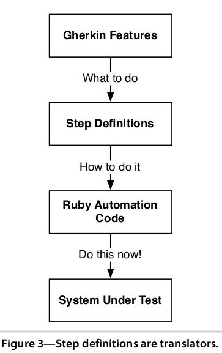

# TDD, BDD

суть: <br/>


## RSpec

```ruby
describe Hash do
  let(:hash) { Hash[:hello, 'world'] }
 
  it { expect(Hash.new).to eq({}) }
 
  it "hashes the correct information in a key" do
    expect(hash[:hello]).to eq('world')
  end
 
  it 'includes key' do
    hash.keys.include?(:hello).should be true
  end
end
```

###nested groups

```ruby
RSpec.describe Order do
  context "with no items" do
    it "behaves one way" do
      # ...
    end
  end

  context "with one item" do
    it "behaves another way" do
      # ...
    end
  end
end
```

###shared collections

```ruby
RSpec.shared_examples "collections" do
  it "is empty when first created" do
    expect(described_class.new).to be_empty
  end
end

RSpec.describe Array do
  include_examples "collections"
end

RSpec.describe Hash do
  include_examples "collections"
end
```

### expectations

```ruby
expect(actual).to eq(expected)  # passes if actual == expected
expect(actual).to eql(expected) # passes if actual.eql?(expected)
expect(actual).to be(expected)    # passes if actual.equal?(expected)
expect(actual).to equal(expected) # passes if actual.equal?(expected)
expect(actual).to be >  expected  # >, <, >=, <=
expect(actual).to be_within(delta).of(expected)
expect(actual).to match(/expression/) #regexp
expect(actual).to be_an_instance_of(expected) # passes if actual.class == expected
expect(actual).to be_a(expected)              # passes if actual.is_a?(expected)
expect(actual).to be_truthy # passes if actual is truthy (not nil or false)
expect(actual).to be true   # passes if actual == true
expect(actual).to be_falsy  # passes if actual is falsy (nil or false)
expect(actual).to be false  # passes if actual == false
expect(actual).to be_nil    # passes if actual is nil
expect { ... }.to raise_error
expect { ... }.to raise_error(ErrorClass)
expect { ... }.to raise_error("message")
expect { ... }.to raise_error(ErrorClass, "message")
expect(1..10).to cover(3)
expect(actual).to include(expected)
expect(actual).to start_with(expected)
expect(actual).to end_with(expected)
expect(actual).to match_array(expected_array)
expect { |b| 5.tap(&b) }.to yield_control # passes regardless of yielded args
expect { |b| yield_if_true(true, &b) }.to yield_with_no_args # passes only if no args are yielded
expect { |b| 5.tap(&b) }.to yield_with_args(5)
expect { |b| 5.tap(&b) }.to yield_with_args(Fixnum)
expect { |b| "a string".tap(&b) }.to yield_with_args(/str/)
expect { |b| [1, 2, 3].each(&b) }.to yield_successive_args(1, 2, 3)
expect { |b| { :a => 1, :b => 2 }.each(&b) }.to yield_successive_args([:a, 1], [:b, 2])
```
###mocks

```ruby
book = instance_double("Book", :pages => 250)
allow(book).to receive(:title).and_return("The RSpec Book") # имеет 2 альтернативных синтакса
```

Consecutive return values

```ruby
allow(die).to receive(:roll).and_return(1, 2, 3)
die.roll # => 1
die.roll # => 2
die.roll # => 3
die.roll # => 3
die.roll # => 3
```

Expecting  messages and arguments

```ruby
expect(double).to receive(:msg).with(*args)
```
пример посложнее

```ruby
expect(double).to receive(:msg).exactly(3).times.and_return(value1, value2, value3)
```

## Capybara

### own DSL for creating descriptive acceptance tests:

```ruby
feature "Signing in" do
  background do
    User.make(:email => 'user@example.com', :password => 'caplin')
  end

  scenario "Signing in with correct credentials" do
    visit '/sessions/new'
    within("#session") do
      fill_in 'Email', :with => 'user@example.com'
      fill_in 'Password', :with => 'caplin'
    end
    click_button 'Sign in'
    expect(page).to have_content 'Success'
  end

  given(:other_user) { User.make(:email => 'other@example.com', :password => 'rous') }

  scenario "Signing in as another user" do
    visit '/sessions/new'
    within("#session") do
      fill_in 'Email', :with => other_user.email
      fill_in 'Password', :with => other_user.password
    end
    click_button 'Sign in'
    expect(page).to have_content 'Invalid email or password'
  end
end
```

expectations:

```ruby
expect(current_path).to eq(post_comments_path(post))
```

clicking:

```ruby
click_link('id-of-link')
click_link('Link Text')
click_button('Save')
click_on('Link Text') # clicks on either links or buttons
click_on('Button Value')
```

Interacting with forms

```ruby
fill_in('First Name', :with => 'John')
fill_in('Password', :with => 'Seekrit')
fill_in('Description', :with => 'Really Long Text...')
choose('A Radio Button')
check('A Checkbox')
uncheck('A Checkbox')
attach_file('Image', '/path/to/image.jpg')
select('Option', :from => 'Select Box')
```

querying

```ruby
page.has_selector?('table tr')
page.has_selector?(:xpath, '//table/tr')
page.has_xpath?('//table/tr')
page.has_css?('table tr.foo')
page.has_content?('foo')
```
finding

```ruby
find_field('First Name').value
find_link('Hello').visible?
find_button('Send').click
find('#navigation').click_link('Home') # in context of #navigation
find(:xpath, "//table/tr").click
find("#overlay").find("h1").click
all('a').each { |a| a[:href] }
```

Scoping

```ruby
within("li#employee") do
  fill_in 'Name', :with => 'Jimmy'
end

within(:xpath, "//li[@id='employee']") do
  fill_in 'Name', :with => 'Jimmy'
end
```

Scripting

```ruby
page.execute_script("$('body').empty()")
```

работа с всплывающими окнами:

```ruby
accept_alert
dismiss_confirm
accept_prompt
```

debugging:

```ruby
page.save_screenshot('screenshot.png')
print page.html
save_and_open_page
save_and_open_screenshot
```

работет с ajax(!!!), expect(...) ждёт ответа от сервера N секунд, время можно поменять 
с помощью Capybara.default_wait_time = 5

### using with RSpec

```ruby
describe "the signin process", :type => :feature do
  before :each do
    User.make(:email => 'user@example.com', :password => 'password')
  end

  it "signs me in" do
    visit '/sessions/new'
    within("#session") do
      fill_in 'Email', :with => 'user@example.com'
      fill_in 'Password', :with => 'password'
    end
    click_button 'Sign in'
    expect(page).to have_content 'Success'
  end
end
```

## BDD vs TDD

'BDD is TDD done right' - Dan North <br/>

-  ubiquitous language
-  testing behavior, not implementation
<br/>
<a href="http://lizkeogh.com/2009/11/06/translating-tdd-to-bdd/">http://lizkeogh.com/2009/11/06/translating-tdd-to-bdd</a>
<table border="1">
    <tbody>
        <tr>
            <th>TDD</th>
            <th>BDD</th>
        </tr>
        <tr>
            <td>test</td>
            <td>example</td>
        </tr>
        <tr>
            <td>class under test</td>
            <td>class we’re describing </td>
        </tr>
        <tr>
            <td>method under test</td>
            <td>valuable behaviour</td>
        </tr>
        <tr>
            <td>what to test</td>
            <td>why is this class valuable? </td>
        </tr>
        <tr>
            <td>how to test</td>
            <td>how do I want to use this class? </td>
        </tr>
        <tr>
            <td>interface </td>
            <td>role </td>
        </tr>
        <tr>
            <td>mock</td>
            <td>collaborator playing &lt;this&gt; role </td>
        </tr>
        <tr>
            <td>design</td>
            <td>responsibility </td>
        </tr>
        <tr>
            <td>passing</td>
            <td>working, providing value </td>
        </tr>
        <tr>
            <td>failing</td>
            <td>should it do what I’ve described? </td>
        </tr>
        <tr>
            <td>verify that</td>
            <td>ensure that </td>
        </tr>
        <tr>
            <td>assert that</td>
            <td>ensure that </td>
        </tr>
        <tr>
            <td>returns true / false</td>
            <td>tells me that… </td>
        </tr>
        <tr>
            <td>returns &lt;object&gt;</td>
            <td>gives me… </td>
        </tr>
        <tr>
            <td>implements &lt;interface&gt;</td>
            <td>provides &lt;the benefit of the role&gt;</td>
        </tr>
        <tr>
            <td>pinning the code down so it won’t break</td>
            <td>making the code easy to use, understand and change. </td>
        </tr>
        <tr>
            <td>100% coverage</td>
            <td>Please, come change my code. I believe I’ve given you enough information to do this safely.</td>
        </tr>
    </tbody>
</table>
  

##Cucumber

### Компоненты:

Gherkin features

```cucumber
Feature: Feedback when entering invalid credit card details

  In user testing we've seen a lot of people who made mistakes
  entering their credit card. We need to be as helpful as possible
  here to avoid losing users at this crucial stage of the
  transaction.

  Background:
    Given I have chosen some items to buy
    And I am about to enter my credit card details

  Scenario: Credit card number too short
    When I enter a card number that's only 15 digits long
    And all the other details are correct
    And I submit the form
    Then the form should be redisplayed
    And I should see a message advising me of the correct number of digits

  Scenario: Expiry date invalid
    When I enter a card expiry date that's in the past
    And all the other details are correct
    And I submit the form
    Then the form should be redisplayed
    And I should see a message telling me the expiry date must be wrong
```

Scenario outline

```cucumber
Feature: Withdraw Fixed Amount

The "Withdraw Cash" menu contains several fixed amounts to
speed up transactions for users.

  Scenario Outline: Withdraw fixed amount
    Given I have <Balance> in my account
    When I choose to withdraw the fixed amount of <Withdrawal>
    Then I should <Outcome>
    And the balance of my account should be <Remaining>
    
    Examples:Successful withdrawal
      | Balance | Withdrawal | Outcome               | Remaining |
      | $500    | $50        | receive $50 cash      | $450      |
      | $500    | $100       | receive $100 cash     | $400      |
    
    Examples:Successful withdrawal
      | Balance | Withdrawal | Outcome               | Remaining |
      | $100    | $200       | see an error message  | $450      |
      | $0      | $50        | see an error message  | $400      |
```

данный код на самом деле создаст 

```console
4 scenarios (4 undefined)
16 steps (16 undefined)
```

Step definitions:

```ruby
Given(/^I have \$(\d+) in my account$/) do |amount|
  #code here
end

Given(/^I choose to withdraw the fixed amount of \$(\d+)$/) do |amount|
  #code here
end

Given(/^I should receive \$(\d+) cash$/) do |amount|
  #code here
end

Given(/^the balance of my account should be \$(\d+)$/) do |amount|
  #code here
end

Given(/^I should see an error message$/) do
  #code here
end
```


схема взаимодействия:




### FLOW:


STEP 1: Creating features

```cucumber
Feature: Adding

  Feature: Adding
  Scenario: Add two numbers
  Given the input "2+2"
  When the calculator is run
  Then the output should be "4"
```
STEP 2: run 'cucumber'

```console
$ cucumber

Feature: Adding
  Scenario: Add two numbers
    Given the input "2+2"
    When the calculator is run
    Then the output should be "4"

1 scenario (1 undefined)
3 steps (3 undefined)
0m0.003s

You can implement step definitions for undefined steps with these snippets:

Given /^the input "([^"]*)"$/ do |arg1|
  pending # express the regexp above with the code you wish you had
end

When /^the calculator is run$/ do
  pending # express the regexp above with the code you wish you had
end

Then /^the output should be "([^"]*)"$/ do |arg1|
  pending # express the regexp above with the code you wish you had
end

If you want snippets in a different programming language,
just make sure a file with the appropriate file extension
exists where cucumber looks for step definitions.
```

STEP3: Creating step definitions

```ruby
Given /^the input "([^"]*)"$/ do |arg1|
  pending # express the regexp above with the code you wish you had
end

When /^the calculator is run$/ do
  pending # express the regexp above with the code you wish you had
end

Then /^the output should be "([^"]*)"$/ do |arg1|
  pending # express the regexp above with the code you wish you had
end
```

STEP 4: run 'cucumber' again and see tests pending:

```console
Feature: Adding
  Scenario: Add two numbers
    Given the input "2+2"
    When the calculator is run
      TODO (Cucumber::Pending)
      ./features/step_definitions/calculator_steps.rb:9
      features/adding.feature:5
    Then the output should be "4"
1 scenario (1 pending)
3 steps (1 skipped, 1 pending, 1 passed)
0m0.002s
```

STEP 5: modify step definition

```ruby
When /^the calculator is run$/ do
  @output = `ruby calc.rb #{@input}`
  raise('Command failed!') unless $?.success?
end
```

STEP 6: run 'cucumber' again and see tests fails:

```console
Feature: Adding
  Scenario: Add two numbers
    Given the input "2+2"
ruby: No such file or directory -- calc.rb (LoadError)
    When the calculator is run
      Command failed! (RuntimeError)
      ./features/step_definitions/calculator_steps.rb:10
      features/adding.feature:5
    Then the output should be "4"

Failing Scenarios:
cucumber features/adding.feature:3

1 scenario (1 failed)
3 steps (1 failed, 1 skipped, 1 passed)
0m0.027s
```

STEP 7: implement functionality:

```ruby
#calculator.rb
print eval(ARGV[0])
```

STEP 8: run cucumber, see step pass, go to the next step (return to STEP 5)


### поддерживает кучу языков, например:

```cucumber
# language: no
Egenskap: Summering
  For å unngå at firmaet går konkurs
  Må regnskapsførerere bruke en regnemaskin for å legge sammen tall

  Scenario: to tall
    Gitt at jeg har tastet inn 5
    Og at jeg har tastet inn 7
    Når jeg summerer
    Så skal resultatet være 12
```


### Use rspec and capybara with cucumber

```ruby
When /I sign in/ do
  visit '/sessions/new'
    within("#session") do
      fill_in 'Email', :with => 'user@example.com'
      fill_in 'Password', :with => 'password'
    end
    click_button 'Sign in'
end

Then /I should be logged in/ do
  expect(page).to have_content 'Success'
end
```


##FactoryGirl


пример фабрики:

```ruby
# spec/factories/user.rb
FactoryGirl.define do
  factory :user do
    sequence(:nickname) { |n| "user_#{n}" }
    sequence(:email) { |n| "email_#{n}@email.com" }
 
    first_name 'Test'
    last_name 'User'
    password '123456'
    password_confirmation '123456'
 
    factory :reader_user do
      role 'reader'
    end
 
    factory :admin_user do
      role 'admin'
    end
 
    factory :moderator_user do
      role 'moderator'
    end
  end
end
```

использование фабрики:

```ruby
FactoryGirl.create :factory_name # создает и сохраняет в БД запись соответствующую фабрике factory_name.
FactoryGirl.build :factory_name # метод аналогичен .create, но запись в БД не происходит.
FactoryGirl.attributes_for :factory_name # возвращает хэш формата { attribute: value } для свойств.
```

пример использования:

```ruby
describe User do
  #...
  describe 'helpers' do
    before :all do
      @user = FactoryGirl.create :reader_user
      @admin = FactoryGirl.create :admin_user
      @moderator = FactoryGirl.create :moderator_user
    end
 
    describe "reader" do
      subject { @user }
 
      its(:full_name) { should == "#{@user.first_name} #{@user.last_name}" }
      its(:is_reader?) { should be_true }
    end
    #...
  end
end
```

обычно используется вместе с DatabaseCleaner

## интересные ссылки по TDD/BDD

-  http://habrahabr.ru/post/111480/ - статья за 2011 год, но вкратце про Cucumber/RSpec/Capybara/FactoryGirl там есть